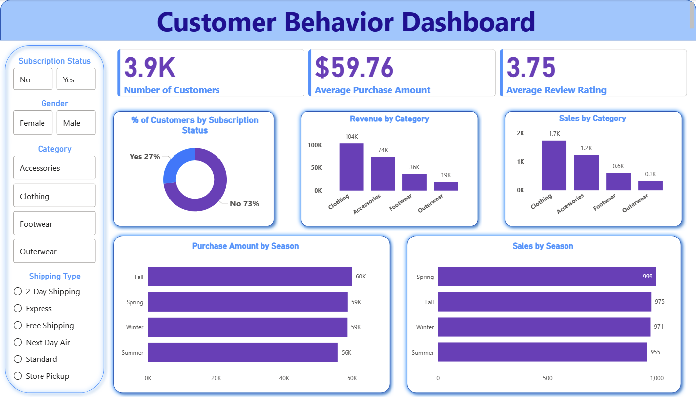

# Customer Purchase Behavior Analytics


---

## Executive Summary

A retail organization wanted to understand **what drives customer spending, loyalty, and repeat behavior** across 3,900 transactions. I used Python for data preparation, PostgreSQL for business-focused querying, and Power BI for interactive visualization — delivering a full-stack analytics pipeline from raw data to boardroom-ready insights.

> **Core question:** How can customer shopping data be analyzed to uncover behavioral trends, strengthen customer engagement, and optimize marketing and product strategies?

---

## Key Results at a Glance

| Metric | Value |
|---|---|
| Transactions analyzed | 3,900 |
| Average purchase amount | $59.76 |
| Average review rating | 3.75 / 5 |
| Top revenue category | Clothing ($104K) |
| Subscription adoption rate | 27% |
| Loyal customer segment | 80% of base (3,116 customers) |
| Express vs. Standard spend gap | +$2.02 average uplift |

---

## Dashboard Preview



*Interactive Power BI dashboard with slicers for subscription status, gender, category, and shipping type.*

---

## Project Workflow

```
Raw Dataset (CSV, 3,900 rows × 18 cols)
        │
        ▼
┌─────────────────────────┐
│  Python (Pandas/NumPy)  │  → Clean, impute, engineer features
│  Jupyter Notebook       │  → age_group, purchase_frequency_days
└─────────────────────────┘
        │
        ▼
┌─────────────────────────┐
│  PostgreSQL             │  → 15 business-focused SQL queries
│  Structured Querying    │  → Segmentation, revenue, loyalty
└─────────────────────────┘
        │
        ▼
┌─────────────────────────┐
│  Power BI               │  → Interactive dashboard
│  Dashboard              │  → Category, season, subscription views
└─────────────────────────┘
        │
        ▼
 Stakeholder Report + Recommendations
```

---

## Dataset Overview

- **Source:** Retail transactional dataset (simulated real-world data)
- **Records:** 3,900 transactions across 18 attributes
- **Dimensions:** Customer demographics, product details, purchase behavior, shipping, discounts, reviews

| Column | Description |
|---|---|
| `customer_id` | Unique customer identifier |
| `age`, `gender`, `location` | Customer demographics |
| `item_purchased`, `category` | Product details |
| `purchase_amount` | Transaction value (USD) |
| `season` | Season of purchase |
| `review_rating` | Customer rating (1–5) |
| `subscription_status` | Whether customer subscribes |
| `shipping_type` | Shipping method used |
| `discount_applied` | Whether a discount was applied (promo_code_used dropped as redundant) |
| `previous_purchases` | Purchase history count |
| `payment_method` | Payment channel |
| `frequency_of_purchases` | Self-reported purchase frequency |
| `age_group` | Engineered: quartile-based segment (Young Adult, Adult, Middle-aged, Senior) |
| `purchase_frequency_days` | Engineered: numeric days mapped from frequency_of_purchases |

**Data quality:** 37 missing values in `review_rating` — imputed using category-level medians.

---

## 1. Data Preparation & Transformation (Python)

**Notebook:** `Customer_Shopping_Behavior_Analysis.ipynb`

Steps performed:
- Loaded `customer_shopping_behavior.csv` from the project root
- Verified data types and structure (`df.info()`, `df.describe()`)
- Identified and imputed 37 missing `review_rating` values using category-level medians
- Standardized all column names to `snake_case` for SQL compatibility
- Engineered `age_group` feature: quartile-based bucketing (`Young Adult`, `Adult`, `Middle-aged`, `Senior`)
- Validated that `discount_applied` and `promo_code_used` were fully redundant — dropped one to avoid duplication
- Exported cleaned dataset to PostgreSQL via `SQLAlchemy`
- Added in-notebook visuals (revenue by category, avg purchase by shipping type) using matplotlib/seaborn

---

## 2. Data Analysis (SQL)

**File:** `Customer_Purchase_Behavior.sql`

Fifteen business-focused queries in five sections: Revenue (Q1–Q3), Product & Category (Q4–Q6), Shipping (Q7), Subscription & Loyalty (Q8–Q10), and Advanced (Q11–Q15). Uses CTEs, window functions, subqueries, DENSE_RANK, and NTILE-based customer spend tiers.

### Query Highlights

**Revenue by gender**
| Gender | Total Revenue |
|---|---|
| Male | $157,890 |
| Female | $75,191 |

**Subscription impact on revenue**
| Subscription Status | Customers | Avg Spend | Total Revenue |
|---|---|---|---|
| No | 2,847 | $59.87 | $170,436 |
| Yes | 1,053 | $59.49 | $62,645 |

> Subscribers show nearly identical average spend — the revenue gap is purely volume-driven, highlighting a significant growth opportunity through subscription acquisition.

**Customer segmentation by loyalty**
| Segment | Count |
|---|---|
| Loyal (>10 purchases) | 3,116 |
| Returning (2–10) | 701 |
| New (≤1) | 83 |

> 80% of the customer base is already loyal — focus should shift from acquisition to retention and upselling.

**Discount dependency (top products)**

Hat (50%), Sneakers (49%), Coat (49%) show the highest discount rates — margin risk if not managed carefully.

---

## 3. Visualization & Dashboard (Power BI)

**File:** `customer_behavior_dashboard.pbix`

The dashboard was built to give stakeholders an at-a-glance view of performance with full drill-down capability.

**Visuals included:**
- KPI cards: Total customers, average purchase amount, average review rating
- Donut chart: Subscription status split (27% Yes / 73% No)
- Bar charts: Revenue by category, Sales by category
- Horizontal bar charts: Purchase amount by season, Sales by season
- Slicers: Subscription status, Gender, Category, Shipping type

**Key visual finding:** Clothing dominates revenue ($104K) but Fall/Spring seasonality is modest — suggesting category mix rather than timing drives performance.

---

## 4. Key Business Insights

1. **Subscription gap is the biggest growth lever** — 73% of customers are not subscribed despite having similar spend levels to subscribers; converting even 10% would add ~$17K in tracked revenue.
2. **Loyal customers are the backbone** — 80% of the base has 10+ purchases; loyalty programs should retain and upsell this segment rather than chase new customers.
3. **Clothing and Accessories drive disproportionate revenue** — together they account for the majority of volume and revenue; marketing concentration here has clear ROI.
4. **Express shipping correlates with higher spend** — customers choosing faster shipping average $60.48 vs. $58.46 for standard; this may reflect higher-intent buyers worth targeting.
5. **Discount dependency is a margin risk** — items like Hat and Sneakers have ~50% discount rates; sustainable pricing strategies are needed before scaling spend.

---

## 5. Business Recommendations

| Priority | Recommendation | Rationale |
|---|---|---|
| High | Launch a subscription incentive campaign | 73% non-subscriber rate with nearly identical spend potential |
| High | Build a loyalty tier program for Loyal segment | 3,116 loyal customers are the revenue foundation |
| Medium | Audit discount strategy for Hat, Sneakers, Coat | ~50% discount rate risks margin erosion at scale |
| Medium | Increase marketing investment in Clothing & Accessories | Highest revenue category with proven demand |
| Low | Design seasonal promotions for Summer | Slightly lower Summer spending — targeted promotions could close the gap |

---

## Repository Structure

```
Customer-Purchase-Behavior-Analytics/
│
├── Customer_Shopping_Behavior_Analysis.ipynb   # Python: data cleaning & feature engineering
├── Customer_Purchase_Behavior.sql              # SQL: 15 business-focused queries
├── customer_behavior_dashboard.pbix            # Power BI: interactive dashboard
├── customer_shopping_behavior.csv              # Raw dataset (3,900 rows)
├── requirements.txt                            # Python dependencies
│
├── images/
│   └── dashboard.png                           # Dashboard screenshot
│
├── Business Problem Overview.pdf               # Project brief
└── Customer Purchase Behavior Analytics.pdf    # Full analytical report
```

---

## Reproducibility

**Python environment:**
```bash
pip install -r requirements.txt
```

**Run the notebook:**
```bash
# From the project root (so customer_shopping_behavior.csv is found)
jupyter notebook Customer_Shopping_Behavior_Analysis.ipynb
```

**Load data into PostgreSQL:**
1. Run the notebook to produce the cleaned dataset, or use the exported `customer` table.
2. Run the SQL file: `psql -d your_database -f Customer_Purchase_Behavior.sql`

**Power BI:**
Open `customer_behavior_dashboard.pbix` in Power BI Desktop and refresh the data connection to the cleaned CSV.

---

## Skills Demonstrated

`Data Cleaning` · `Feature Engineering` · `Exploratory Data Analysis` · `SQL (CTEs, Window Functions, Subqueries)` · `Business Intelligence` · `Dashboard Design` · `Data Storytelling` · `Stakeholder Communication`

---

*Analysis by Jibek Gupta · [jibekgupta059@gmail.com](mailto:jibekgupta059@gmail.com)*
